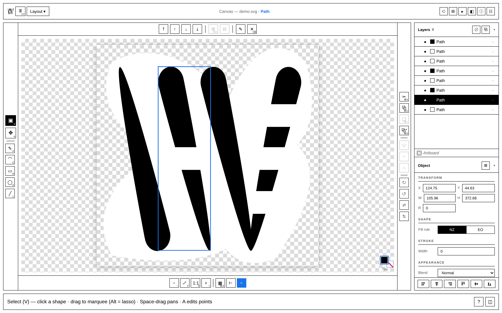
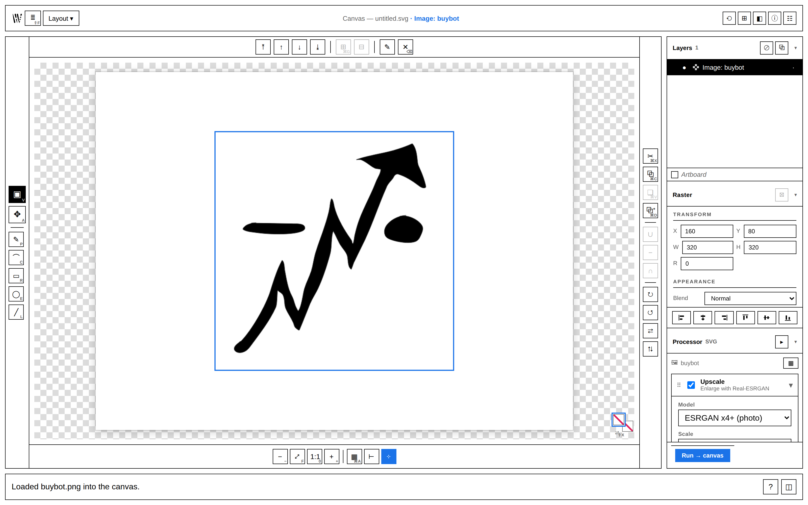
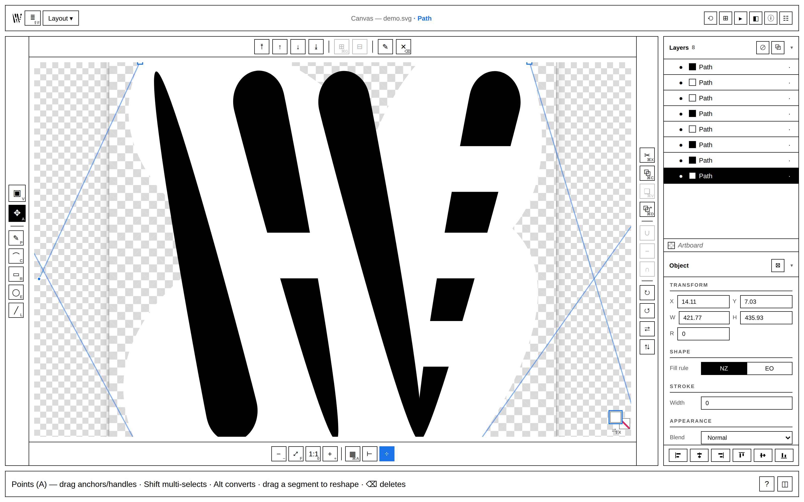
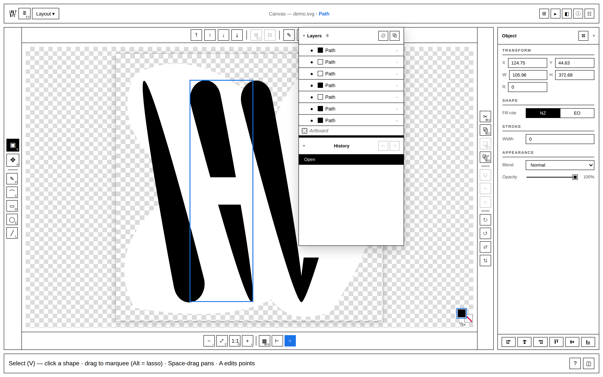

# hector-vector

**A browser-based SVG vector editor with a raster→vector pipeline folded right in.** Draw and edit vectors, *or* drop in a raster and upscale → cut out → trace it on the same canvas. Self-hosted and local — nothing is uploaded; everything runs on your machine.

`v1.0.0` · MIT · stdlib Python backend + dependency-free ES-module frontend · no build step



It began as a batch "image studio" and grew a real editor — and now the canvas is the product. Pen and shape tools, boolean operations, direct node editing, layers, and a dockable-panel workspace; with the upscale / cutout / vectorize pipeline available as a **contextual panel** on any raster you place. It is *not* a Photoshop clone — it does vector editing and a tight set of raster↔vector jobs really well.

> **This README is the project's public status surface.** Jump to **[Features](#features)** for everything it does today and **[Roadmap & status](#roadmap--status)** for what's shipped, in progress, and planned.

## Contents

- [Screenshots](#screenshots)
- [Quick start](#quick-start)
- [Features](#features)
  - [Canvas & document](#canvas--document) · [Drawing tools](#drawing-tools) · [Path & node editing](#path--node-editing) · [Object operations](#object-operations) · [Fill, stroke & colour](#fill-stroke--colour) · [Workspace & panels](#workspace--panels) · [Raster→vector pipeline](#rastervector-pipeline) · [Vectorize engines](#vectorize-engines) · [Pixel Art → SVG](#pixel-art--svg) · [Library & export](#library--export) · [Platform](#platform)
- [Keyboard shortcuts](#keyboard-shortcuts)
- [Requirements](#requirements)
- [Roadmap & status](#roadmap--status)
- [Architecture](#architecture)
- [Configuration](#configuration)
- [Credits & license](#credits--license)

## Screenshots

| Place a raster, process it in place | Edit nodes on a path | Float & snap panels |
|---|---|---|
|  |  |  |
| The **Processor** appears on a selected raster: Upscale → Remove BG → Vectorize, run to canvas. | Direct anchor/handle editing; dense traces stay editable (the node tool LOD-culls handles). | Panels tear off, snap into bezel-locked groups, or shelve as squares. |

## Quick start

```bash
git clone https://github.com/asuramaya/hector-vector
cd hector-vector
./install.sh                      # creates .venv, installs deps, runs a smoke test
./run.sh                          # serves http://localhost:2002
```

`./install.sh --desktop` also installs the app-launcher shortcut; `--app` opens the standalone window when done. Prefer your own environment? `pip install -r requirements.txt` still works — `run.sh` uses `.venv` when present and otherwise falls back to system `python3`.

Open **http://localhost:2002**. Draw with the shape/pen tools, or drop an image onto the canvas (or into the Library), select it, and use the **Processor** panel to upscale / cut out / vectorize it.

> First run downloads the heavy external tools into `./tools` and `./.venv` automatically — see [How dependencies bootstrap](#how-dependencies-bootstrap). They are **not** vendored in this repo.

### Updating

`hector-vector` updates in place from this repo. In the app: **Settings → Updates → Check for updates**; if a newer release exists and your working tree is clean, hit **Update & restart** (runs `git pull` + re-syncs deps). Or `git pull && ./install.sh` yourself. Maintainers cut a release with `./scripts/release.sh X.Y.Z` (bumps `VERSION`, tags `vX.Y.Z`, pushes — the tag triggers the release workflow).

## Features

The canvas is a live SVG document — everything you see is real DOM you can inspect, select, and edit.

### Canvas & document

- **Live SVG canvas** with zoom/pan, fit-to-view, optional **rulers** and **smart guides** (snap to edges/centres of other objects).
- **Artboard as an object** — select it to set its size and background; objects can align to it.
- **Snapshot undo/redo** over the whole document, with a **History** panel.
- **Projects** — save/open `.hv` documents (preserves layers + history); "resume last document" on startup is opt-in.
- **Transparency** — checkerboard backdrop; transparent artboards are first-class.

### Drawing tools

| Tool | Key | Notes |
|---|---|---|
| **Select** | `V` | Move, scale, rotate via the bounding box; marquee/lasso select; space-drag to pan. |
| **Node** | `A` | Direct anchor & bézier-handle editing (see below). |
| **Pen** | `P` | Draw paths; corner + smooth anchors; rubber-band; click the first anchor to close; Ctrl/Cmd for temporary direct-select. |
| **Curvature** | `C` | Draw smooth curves by dropping points; the path fits through them. |
| **Rectangle** | `R` | Drag to draw; **corner radius** parameter → rounded rects. |
| **Ellipse** | `E` | Drag to draw; Shift-constrain to a circle. |
| **Line** | `L` | Straight segments. |

Shape tools are **live shapes** — rect/ellipse keep editable parameters (size, corner radius, **polygon** sides, **star** points) until you freeze them into a path. New shapes inherit the last-used style.

### Path & node editing

- **Anchors & handles** — drag anchors or their bézier handles; Shift multi-selects; **Alt converts** an anchor between corner and smooth; drag a segment to reshape it.
- **Join / close** paths (`Ctrl/Cmd+J`), delete selected points, insert points on a segment.
- **Edits scale to huge paths** — the node tool **LOD-culls** handles so a 10,000-anchor traced path stays editable (zoom in for more detail) instead of refusing to open.

### Object operations

- **Transform** — move, **scale** (`Ctrl/Cmd+T`), and rotate; numeric X/Y/W/H/rotation in Properties.
- **Boolean operations** — **Union**, **Subtract**, **Intersect** on any selection, built on a marching-squares engine (robust for any overlap or winding) that refits results to *minimal cubic béziers* with crisp corners — not heavy polylines.
- **Invert-space** — punch the selection out of its bounds (same boolean engine; overlaps merge into one hole).
- **Align** — left / right / top / bottom / centre / middle, to the selection or to the artboard.
- **Arrange** — raise / lower / bring-to-front / send-to-back z-ordering.
- **Layers & groups** — a Layers panel with visibility, lock, rename, drag-reorder, group/ungroup, and merge; **even-odd vs nonzero** fill control.
- **Duplicate** (`Ctrl/Cmd+D`), copy/cut/paste, delete.

### Fill, stroke & colour

- **Fill & stroke** with a live colour picker (the **Colour** panel hosts an embedded duo editor — swap fill/stroke with `X`).
- **Stroke** width and **alignment** (centre / inside / outside).
- **Opacity** and **blend mode** per object.
- Edits are live — drag a swatch and the canvas updates immediately.

### Workspace & panels

A fully dockable, panel-based workspace (`window.__docks`):

- **Panels** — Properties, Colour, Layers, History, Library, Processor, Jobs, Info.
- **Dock / float / group / shelf** — dock panels left or right, tear them off to **float**, snap floats into **locking-bezel groups** that resize and move together (double-click a bezel to split), or park any panel on a **shelf** in the header as a square.
- **Contextual panels** — Processor and Colour **auto-appear when relevant** (a raster selected, an object selected) and tuck themselves back onto the shelf when there's nothing to act on. A panel you place by hand stays put.
- **Memory** — panels remember their last position/size; fresh floats get an ideal, non-overlapping placement.
- Right-click a panel header to shelve it; right-click a shelf square for open / float / dock options.

### Raster→vector pipeline

Drop a raster onto the canvas (it becomes a selectable, movable `<image>` node) and the **Processor** panel becomes relevant. It's a composable stage strip — toggle any stage on/off and reorder them:

| Stage | What it does | Backends |
|---|---|---|
| **Upscale** | GPU super-resolution | Real-ESRGAN (NCNN/Vulkan), 2×/3×/4×, photo & anime models |
| **Remove BG** | background removal / keying | classical (numpy), AI (`rembg`: U²-Net, ISNet, **BiRefNet**, silueta, portrait/anime), greenscreen chroma-key |
| **Vectorize** | raster → SVG | clean colour trace · VTracer · pixel-exact (see below) |

Runs target the selected raster or the whole Library (explicit batch toggle), execute in a **background job queue** with live progress and per-job logs (the **Jobs** panel), and **never mutate your live canvas** — you choose when to load the result back in. Live preview is available while you tune a single raster.

### Vectorize engines

One resolver picks the engine from your settings (explicit choice wins; legacy keys derive):

- **Clean colour trace** — hard k-means palette + per-colour B&W mask trace. Drops the background to transparent, keeps pure ink colours, and **preserves holes/counters** (the inside of an "o"). Fixes VTracer's stacked halos and lost counters on flat logos.
- **VTracer** — general-purpose colour/B&W curve tracing for photos and illustrations.
- **Pixel-exact** — recovers the native pixel grid (see below).

Both vectorize engines and the background-removal/upscale ops are **pluggable registries** on the backend (`VECTORIZE_ENGINES`, `RASTER_OPS`) with schema introspection, so adding a model is a registry entry.

### Pixel Art → SVG

Most "vectorizers" smooth pixel art into mush. This one does the opposite: it recovers the original pixel grid and emits perfect squares.


1. **Grid recovery.** Block-consistency detection nails clean nearest-neighbour integer upscales exactly (a 16×16 texture saved at 256×256 → recovered to 16×16). Odd, non-integer scales use a spectral (FFT) detector; a confident axis lends its scale to a weak one. True gradients/photos are left untouched.
2. **Colour recovery.** Per cell: mode (default) / median / center, sampled over an eroded interior so anti-aliased borders don't leak. Optional palette quantization and corner-colour key-out.
3. **Square emission.** `merged` rects (default), per-colour `path` (fewest nodes), or one rect per pixel — all pixel-exact, with `shape-rendering="crispEdges"` and native-unit coordinates so they scale forever.

Heavily *bilinear*-resampled art is genuinely ambiguous; set **Native size (cells)** in the trace settings to force the grid.

### Library & export

- **Library** panel with three modes — **rasters** (source images), **vectors** (output SVGs), **canvases** (`.hv` projects). Thumbnails, search, rename/delete, drag onto the canvas, and an **Info** panel (dimensions, size, path, element/colour counts, reveal-in-file-manager).
- **Source folder** — point the Library at any directory; uploads land in `inputs/`.
- **Export PNG** — rasterize any SVG to PNG at *any* size, rendered **client-side** in the browser (vectors are resolution-independent). Pixel-art SVGs export with crisp edges and need nothing extra.
- **Export / save SVG** — write the document back out.

### Platform

- **Local job queue** — background workers with cancel/retry/clear and live status; nothing leaves your machine.
- **Standalone window** — `?app=1` (or `./install.sh --app`) runs it as an app window with a draggable titlebar; native window manager controls.
- **Self-updating** — in-app update check + apply (`git pull` + dep re-sync) gated on a clean tree.
- **Settings** — install/repair external tools, source folder, startup behaviour, rulers/guides.

## Keyboard shortcuts

| | |
|---|---|
| **Tools** | `V` select · `A` node · `P` pen · `C` curvature · `R` rect · `E` ellipse · `L` line |
| **Edit** | `Ctrl/Cmd+Z` undo · `Ctrl/Cmd+Shift+Z` / `Ctrl/Cmd+Y` redo · `Ctrl/Cmd+D` duplicate · `Ctrl/Cmd+C/X/V` copy/cut/paste · `Delete` remove |
| **Object** | `Ctrl/Cmd+G` group · `Ctrl/Cmd+Shift+G` ungroup · `Ctrl/Cmd+J` join nodes · `Ctrl/Cmd+T` scale · `Ctrl/Cmd+A` select all |
| **Colour** | `X` swap fill/stroke · `D` default fill/stroke (in the Colour panel) |
| **Document** | `Ctrl/Cmd+S` save · `Ctrl/Cmd+Shift+S` save as · `Ctrl/Cmd+R` rulers/guides · `Esc` clear selection / exit transform |

## Requirements

- **Python 3.10+** with `pip`. The base runtime (`Pillow`, `numpy`, `scipy`) is installed by `./install.sh` (or `pip install -r requirements.txt`).
- For **Upscale / Trace**: `curl` + `unzip` (Real-ESRGAN download) and `cargo` (builds VTracer). Installed on first launch or via the Settings buttons.
- For **AI Cutout**: nothing up front — click *Install rembg* in Settings to pull `rembg[cpu]` into a project-local `./.venv` (~500 MB, one-time).
- For **Export PNG of curved (VTracer) SVGs**: optional `cairosvg` (`pip install cairosvg`, needs system libcairo). Pixel-art SVG export needs nothing extra — it's pure Pillow.
- A Vulkan-capable GPU helps Real-ESRGAN but isn't mandatory.

### How dependencies bootstrap

`hector-vector` ships **code only**. On launch (and via retry buttons in Settings) it fetches what's missing:

| Tool | How it's obtained | License |
|------|-------------------|---------|
| Real-ESRGAN NCNN Vulkan | downloaded from the project's GitHub releases into `./tools` | BSD-3-Clause |
| VTracer | `cargo install vtracer --root ./tools/cargo` | MIT |
| rembg (+ ONNX models) | `pip install 'rembg[cpu]' onnxruntime` into `./.venv`; model weights download to `~/.u2net` on first use | MIT (models: Apache-2.0 / MIT) |
| cairosvg *(optional)* | `pip install cairosvg` | LGPL-3.0 |

## Roadmap & status

The deep research behind pipeline picks — every category, the OSS SOTA, and the licensing landmines — lives in **[`ROADMAP.md`](ROADMAP.md)**. This section is the practical board.

### Shipped

- [x] **Editor reframe** — single live-SVG canvas, selection, snapshot undo/redo, inspector, artboard-as-object.
- [x] **Tools** — select, node, pen, curvature, rect, ellipse, line; live shapes (rounded rect, polygon, star).
- [x] **Path/node editing** with anchor↔handle conversion and LOD culling for huge traced paths.
- [x] **Boolean ops** (union / subtract / intersect) + invert-space on a marching-squares engine that refits to minimal cubics.
- [x] **Layers** (visibility / lock / rename / reorder / group / merge), align, arrange, transform.
- [x] **Dockable workspace** — float / dock / locking-bezel groups / shelf / contextual auto-shelve.
- [x] **Rasters as canvas objects** — `editor.placeImage()`; the **Processor** pipeline as a contextual in-canvas panel.
- [x] **Pipeline** — Upscale (Real-ESRGAN), Remove BG (rembg / classical / chroma-key), Vectorize (clean / VTracer / pixel), as a composable stage strip with a background job queue.
- [x] **Pixel Art → SVG**, **client-side PNG export**, **`.hv` projects**, **Library**, in-app **self-update**, **app-window** mode.

### In progress / open edges

- [ ] **Self-contained SVG export** — bake `<image href>` to a data-URI so exported SVGs with embedded rasters stay portable.
- [ ] **Mixed raster+vector documents** — finish the "raster as a first-class canvas object" track (raster nodes have no meaningful fill/stroke; tighten the model).
- [ ] **More of the pipeline as contextual panels** — continue dissolving batch-only flows into the editor.

### Planned

- [ ] **Text tool** (the main parity gap).
- [ ] **Distribute** spacing + **multi-object transform handles** (group rotate/scale) + **multiple artboards**.
- [ ] **Better cutout** — BiRefNet / BEN2 as opt-in high-quality background removal (hair/edges).
- [ ] **More upscalers via `spandrel`** — DAT-2 (quality), SPAN (fast/CPU), Real-CUGAN (anime); model swap as config.
- [ ] **Inpainting / object removal** — LaMa via IOPaint.
- [ ] **Face restoration** (GFPGAN) and a **denoise / de-JPEG pre-pass** (SCUNet / FBCNN) for low-quality inputs.
- [ ] **Vectorize "quality" tier** — VTracer is the only viable OSS colour vectorizer; closed engines (Vectorizer.ai) are meaningfully better on photos. Optional paid-API fallback is on the table.

### Known limitations

- Pixel-grid recovery is genuinely ambiguous on heavily *bilinear*-resampled art — set the native size manually.
- Exported VTracer (curved) SVGs need `cairosvg` to rasterize back to PNG; pixel-art SVGs don't.
- Non-commercial models (SUPIR, CodeFormer, BRIA RMBG, MAT, …) are deliberately **not** shipped — see the licensing avoid-list in `ROADMAP.md`.

## Architecture

No build step anywhere — the frontend is hand-written ES modules served as-is.

- **`src/`** — the dependency-free vanilla-JS frontend:
  - **`src/hv/`** — a pure, side-effect-free library: geometry & path math (`path`, `transform`, `shapes`, `shapegen`), colour (`color`), raster sampling (`raster`), and the marching-squares boolean/contour engine with its shared curve-fit core (`contour`, `fitcurve`).
  - **`src/editor.js`** — the live-SVG editing core: selection, the tools, snapshot undo, layers, and the boolean operations.
  - **`src/app.js`** — the app shell: the dockable-panels system (`window.__docks`), the Library, the Processor pipeline UI, Info, and client-side PNG export.
- **`server.py`** — a single-file backend on Python's stdlib `http.server`, with a threaded job queue and a JSON API (`/api/run/pipeline`, `/api/vectorize/engines`, `/api/raster-ops`, `/api/work-items`, `/api/install/*`, …). It's organized around two pluggable registries: **vectorize engines** (`clean` / `vtracer` / `pixel`) behind one resolver, and **raster ops** (`upscale` / `removebg`). No web framework.
- **`engine.py`, `mask_trace_prep.py`** — classical mask/cutout image ops.
- **`tools/`** — our worker scripts (`pixelvec.py`, `svg_render.py`, `ai_cutout.py`, `simplify_svg.py`); external binaries land here at runtime.
- Vector documents save as **`.hv` projects** under `outputs/canvas/`; pipeline outputs under `outputs/<process>-<timestamp>/`. Your source images live in `inputs/` (or any folder you point the Library at).

Contributions welcome — see [`CONTRIBUTING.md`](CONTRIBUTING.md). The editor has a real-browser E2E suite (`tests/e2e/editor_e2e.py`) and a backend smoke suite (`tests/test_smoke.py`); the README screenshots are regenerated with `tests/e2e/screenshots.py`.

## Configuration

| Variable | Default | Purpose |
|----------|---------|---------|
| `PORT` | `2002` | Server port (`PORT=8080 ./run.sh`). |
| `HECTOR_CONCURRENCY` | `1` | Parallel jobs. Raise carefully — GPU/RAM bound. |

## Credits & license

Built on excellent open-source work: [Real-ESRGAN](https://github.com/xinntao/Real-ESRGAN), [VTracer](https://github.com/visioncortex/vtracer), [rembg](https://github.com/danielgatis/rembg) & the U²-Net / [BiRefNet](https://github.com/ZhengPeng7/BiRefNet) model families, [Pillow](https://python-pillow.org/), and [NumPy](https://numpy.org/). See [`ROADMAP.md`](ROADMAP.md) for the broader landscape and what's planned next.

[MIT](LICENSE) © 2026 asuramaya. Bundled-at-runtime tools keep their own licenses (see the table above).
