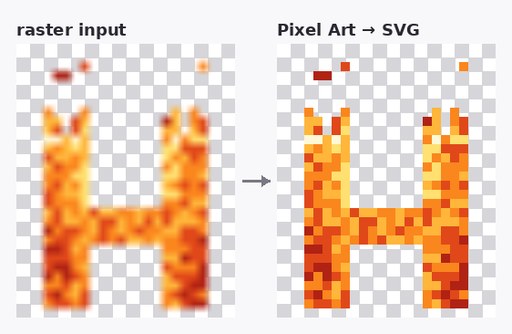

# hector-vector

**A self-hosted image studio for the boring-but-essential jobs — upscale, cut out, key, vectorize, and render.** One local web app instead of a dozen sketchy "free online image tool" sites. Nothing is uploaded; everything runs on your machine.



It is *not* a Photoshop clone. It does a small set of raster ↔ vector pipelines really well:

- **Upscale PNG** — GPU super-resolution via Real-ESRGAN (NCNN/Vulkan), 2×/3×/4×, photo & anime models.
- **Cutout PNG** — background removal. Classical (fast, numpy) **or** AI (`rembg`: U²-Net, ISNet, **BiRefNet**, silueta, portrait/anime).
- **Greenscreen Cutout** — chroma-key keying.
- **SVG Trace / Production SVG** — raster → clean vector via VTracer, with an upscale→mask→trace pipeline.
- **Pixel Art → SVG** — recover the *native pixel grid* of (even upscaled / odd-resolution) pixel art and emit exact axis-aligned squares. No smoothing.
- **Export PNG** — rasterize any output SVG back to PNG at *any* size (vectors are resolution-independent).

A local job queue runs everything in the background with live progress, and a browser UI gives you side-by-side input/output preview, zoom/pan, image info, and one-click reveal-in-file-manager.

## Quick start

```bash
git clone https://github.com/asuramaya/hector-vector
cd hector-vector
pip install -r requirements.txt   # Pillow + numpy (the rest auto-installs on demand)
./run.sh                          # serves http://localhost:2002
```

Open **http://localhost:2002**, drop in some images (or point the source folder at any directory), pick a process, and hit **Run**.

> First run downloads the heavy external tools into `./tools` and `./.venv` automatically — see below. They are **not** vendored in this repo.

## Requirements

- **Python 3.10+** with `pip` (only `Pillow` and `numpy` are required to start).
- For **Upscale / Trace**: `curl` + `unzip` (Real-ESRGAN download) and `cargo` (builds VTracer). Installed on first launch or via the Settings buttons.
- For **AI Cutout**: nothing up front — click *Install rembg* in Settings to pull `rembg[cpu]` into a project-local `./.venv` (~500 MB, one-time).
- For **Export PNG of curved (VTracer) SVGs**: optional `cairosvg` (`pip install cairosvg`, needs system libcairo). Pixel-art SVG export needs nothing extra — it's pure Pillow.
- A Vulkan-capable GPU helps Real-ESRGAN but isn't mandatory.

### How dependencies bootstrap

`hector-vector` ships **code only**. On launch (and via retry buttons in Settings) it fetches what's missing:

| Tool | How it's obtained | License |
|------|-------------------|---------|
| Real-ESRGAN NCNN Vulkan | downloaded from the project's GitHub releases into `./tools` | BSD-3-Clause |
| VTracer | `cargo install vtracer --root ./tools/cargo` | MIT |
| rembg (+ ONNX models) | `pip install 'rembg[cpu]' onnxruntime` into `./.venv`; model weights download to `~/.u2net` on first use | MIT (models: Apache-2.0 / MIT) |
| cairosvg *(optional)* | `pip install cairosvg` | LGPL-3.0 |

## The standout: Pixel Art → SVG

Most "vectorizers" smooth pixel art into mush. This one does the opposite: it recovers the original pixel grid and emits perfect squares.

1. **Grid recovery.** Block-consistency detection nails clean nearest-neighbour integer upscales exactly (e.g. a 16×16 Minecraft texture saved at 256×256 → recovered to 16×16). For odd, non-integer scales it uses a spectral (FFT) detector, and because upscaling is virtually always uniform, a confident axis lends its scale to a weak one. True gradients/photos are left untouched.
2. **Colour recovery.** Per cell: mode (default) / median / center, sampled over an eroded interior so anti-aliased borders don't leak. Optional palette quantization and corner-colour key-out.
3. **Square emission.** `merged` rects (default), per-colour `path` (fewest nodes), or one rect per pixel — all pixel-exact, with `shape-rendering="crispEdges"` and native-unit coordinates so they scale forever.

Heavily *bilinear*-resampled art is genuinely ambiguous; set **Native size (cells)** in Settings to force the grid.

Try it:

```bash
# examples/fire_h_x11.png is a 264×330 nearest upscale of an original 24×30 sprite
# In the UI: process = "Pixel Art → SVG", drop examples/fire_h_x11.png, Run.
# Then click "Export PNG" on the result to render it crisp at 512, 1024, 4096…
```

## Architecture

- **`server.py`** — a single-file backend on Python's stdlib `http.server`, with a threaded job queue, a JSON API (`/api/run/<process>`, `/api/render`, `/api/install/*`, …), and per-tool dispatch. No web framework.
- **`app.js` / `index.html` / `style.css`** — a dependency-free vanilla-JS frontend (no build step).
- **`engine.py`, `mask_trace_prep.py`** — classical mask/cutout image ops.
- **`tools/`** — our worker scripts (`pixelvec.py`, `svg_render.py`, `ai_cutout.py`); external binaries land here at runtime.
- Outputs are written under `outputs/<process>-<timestamp>/`; your source images live in `inputs/` (or any folder you point it at).

## Configuration

| Variable | Default | Purpose |
|----------|---------|---------|
| `PORT` | `2002` | Server port (`PORT=8080 ./run.sh`). |
| `HECTOR_CONCURRENCY` | `1` | Parallel jobs. Raise carefully — GPU/RAM bound. |

## Credits

Built on excellent open-source work: [Real-ESRGAN](https://github.com/xinntao/Real-ESRGAN), [VTracer](https://github.com/visioncortex/vtracer), [rembg](https://github.com/danielgatis/rembg) & the U²-Net / [BiRefNet](https://github.com/ZhengPeng7/BiRefNet) model families, [Pillow](https://python-pillow.org/), and [NumPy](https://numpy.org/). See [`ROADMAP.md`](ROADMAP.md) for the broader landscape and what's planned next.

## License

[MIT](LICENSE) © 2026 asuramaya. Bundled-at-runtime tools keep their own licenses (see the table above).
