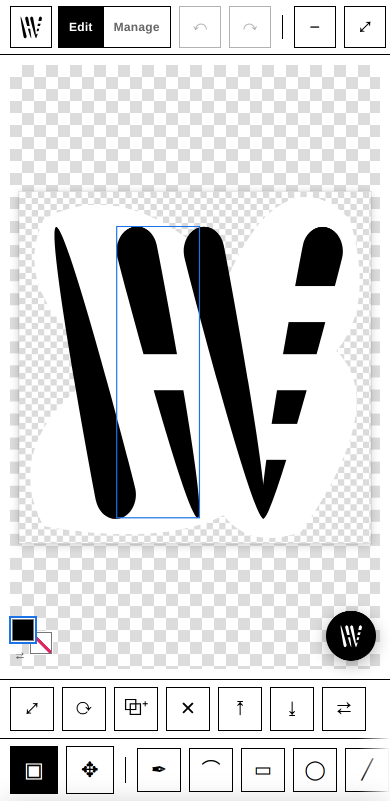
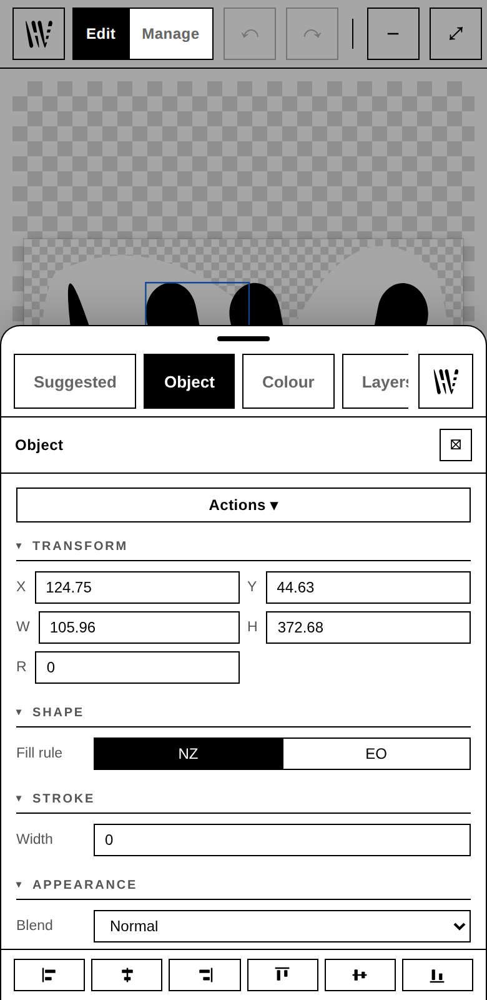
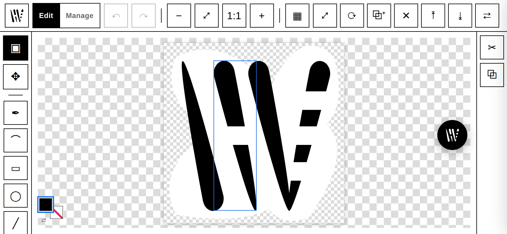

# hector-vector

**A real SVG vector editor that runs in your browser, with an AI raster→vector pipeline folded into the same canvas.** Draw and edit vectors, *or* drop in a raster and upscale → cut out → trace it in place. Nothing is uploaded. The browser build computes everything in the tab; the desktop build runs everything on your machine.

### → **[hector-vector.com](https://hector-vector.com)**. Free, no install, no account. Open it and draw.

`v1.3.0` · MIT · stdlib Python backend + dependency-free ES-module frontend · no build step


It began as a batch "image studio" and grew an editor, and now the canvas is the product. Pen and shape tools, boolean operations and Pathfinder, a geometric stroker, gradients, masks, live effects, text on a path, direct node editing, layers, a dockable-panel workspace. It is not a Photoshop clone. It does vector editing, plus a tight set of raster↔vector jobs, really well.

**Two ways to run it, one codebase:**

| | **[hector-vector.com](https://hector-vector.com)** (browser) | **The desktop app** (this repo) |
|---|---|---|
| | The complete vector toolset, free | Everything in the browser, plus… |
| | Zero install · any browser · phone, tablet or laptop | The **AI image pipeline**: upscale, background removal, vectorize, restore |
| | Open `.svg`, export SVG / PNG | Batch job queue · local Library · `.hv` projects with history |
| | Nothing leaves the tab | 2000+ fonts, complex scripts, fully offline |

The browser build is the *same editor*. It just can't run a 500 MB PyTorch model in a tab. [Full comparison →](https://hector-vector.com/compare)

> **This README is the project's public status surface.** Jump to **[Features](#features)** for everything it does today, or **[Roadmap & status](#roadmap--status)** for what's shipped, in progress, and planned.

## Contents

- [Screenshots](#screenshots)
- [Quick start](#quick-start)
- [Features](#features)
  - [Canvas & document](#canvas--document) · [Drawing tools](#drawing-tools) · [Path & node editing](#path--node-editing) · [Text & fonts](#text--fonts) · [Object operations](#object-operations) · [Fill, stroke & colour](#fill-stroke--colour) · [Workspace & panels](#workspace--panels) · [Touch, phone & tablet](#touch-phone--tablet) · [Raster→vector pipeline](#rastervector-pipeline) · [Vectorize engines](#vectorize-engines) · [Pixel Art → SVG](#pixel-art--svg) · [Library & export](#library--export) · [Platform](#platform)
- [Keyboard shortcuts](#keyboard-shortcuts)
- [Requirements](#requirements)
- [Roadmap & status](#roadmap--status)
- [Architecture](#architecture)
- [Configuration](#configuration)
- [Credits & license](#credits--license)

## Screenshots

| Place a raster, process it in place | Edit nodes on a path | Float & snap panels |
|---|---|---|
|  |  |  |
| The **Processor** appears on a selected raster: Upscale → Remove BG → Vectorize, run to canvas. | Direct anchor/handle editing. Dense traces stay editable (the node tool LOD-culls handles). | Panels tear off, snap into bezel-locked groups, or shelve as squares. |

The same editor runs on a phone. Not a viewer, not a cut-down "mobile version":

| The bar reads your selection | One pane owns the sheet | Landscape surrounds the canvas |
|---|---|---|
|  |  |  |
| Select something and the bar under the canvas already offers what you can do with it. No digging. | The Panels sheet is a **tab strip**, not a stack. Pick one and it takes the whole sheet. | Sideways, the buttons **surround** the canvas, in the same language as the desktop. |

## Quick start

**In the browser, nothing to install:** open **[hector-vector.com](https://hector-vector.com)** and draw. Works on a phone or tablet too.

**On your machine, the full build with the AI pipeline:**

```bash
git clone https://github.com/asuramaya/hector-vector
cd hector-vector
./install.sh                      # creates .venv, installs deps, runs a smoke test
./run.sh                          # serves http://localhost:2002
```

`./install.sh --desktop` also installs the app-launcher shortcut; `--app` opens the standalone window when done. Prefer your own environment? `pip install -r requirements.txt` still works. `run.sh` uses `.venv` when present and otherwise falls back to system `python3`.

Open **http://localhost:2002**. Draw with the shape/pen tools, or drop an image onto the canvas (or into the Library), select it, and use the **Processor** panel to upscale / cut out / vectorize it.

> First run downloads the heavy external tools into `./tools` and `./.venv` automatically. See [How dependencies bootstrap](#how-dependencies-bootstrap). They are **not** vendored in this repo.

### Updating

`hector-vector` updates in place from this repo. In the app: **Settings → Updates → Check for updates**. If a newer release exists and your working tree is clean, hit **Update & restart** (runs `git pull` + re-syncs deps). Or `git pull && ./install.sh` yourself. Maintainers cut a release with `./scripts/release.sh X.Y.Z`, which bumps `VERSION`, tags `vX.Y.Z`, and pushes; the tag triggers the release workflow.

## Features

The canvas is a live SVG document. Everything you see is real DOM you can inspect, select, and edit.

### Canvas & document

- **Live SVG canvas** with zoom/pan, fit-to-view, optional **rulers** and **smart guides** (snap to edges/centres of other objects).
- **Artboard as an object.** Select it to set its size and background; objects can align to it.
- **Snapshot undo/redo** over the whole document, with a **History** panel.
- **Projects.** Save/open `.hv` documents (preserves layers + history). "Resume last document" on startup is opt-in.
- **Transparency.** Checkerboard backdrop; transparent artboards are first-class.
- **Load just works.** Dropping an image into an empty editor auto-creates a canvas **sized to the image**: no "create a canvas first" step, no cramming into a default box.

### Drawing tools

| Tool | Key | Notes |
|---|---|---|
| **Select** | `V` | Move, scale, rotate via the bounding box; marquee/lasso select; space-drag to pan. |
| **Node** | `A` | Direct anchor & bézier-handle editing (see below). |
| **Pen** | `P` | Draw paths; corner + smooth anchors; rubber-band; click the first anchor to close; Ctrl/Cmd for temporary direct-select. |
| **Curvature** | `C` | Draw smooth curves by dropping points; the path fits through them. |
| **Rectangle** | `R` | Drag to draw; **corner radius** parameter → rounded rects. |
| **Ellipse** | `E` | Drag to draw; Shift-constrain to a circle. |
| **Line** | `L` | Straight segments. |

Shape tools make **live shapes**: rect and ellipse keep editable parameters (size, corner radius, **polygon** sides, **star** points) until you freeze them into a path. New shapes inherit the last-used style.

### Path & node editing

- **Anchors & handles.** Drag anchors or their bézier handles; Shift multi-selects; **Alt converts** an anchor between corner and smooth; drag a segment to reshape it.
- **Join / close** paths (`Ctrl/Cmd+J`), delete selected points, insert points on a segment.
- **Edits scale to huge paths.** The node tool **LOD-culls** handles, so a 10,000-anchor traced path stays editable (zoom in for more detail) instead of refusing to open.

### Text & fonts

- **Text tool** (`T`). Click for point text, drag for a wrapping **text box** (with a Width/Height frame + overflow warning), or bind text to a path. Edits happen in an inline overlay aligned under any zoom/pan/rotate. Multi-line, alignment, weight/style, letter- and line-spacing live in Properties.
- **Multi-source font discovery.** Search and download from **Fontsource, Fontshare, Google, and Bunny** (2000+ families, no API keys) without leaving the app. Picked fonts install to a local cache and join an **Installed** library that survives reloads. Offline, Installed + System fonts still work.
- **Text on a path.** Flow text along any curve, ellipse, rect, line, or polygon (offset / side / detach), with a **live curved preview** as you type.
- **Text styles.** Save a text object's font/weight/size/alignment/spacing as a **named style**; apply it elsewhere and every object sharing it updates when you edit the style. One "Text style" row in Properties (apply / save / rename / detach / delete).
- **Threaded text.** Link one area-text box to another (Actions ▾ → **Thread**); overflow that doesn't fit the first box's height flows into the next, recursively down a chain. A dashed connector with in/out ports shows the link on selection.
- **Convert to outlines.** Turn text into editable vector paths that match the rendered glyphs exactly. Shaping (kerning + ligatures) is browser-faithful via **HarfBuzz** when available, with a Latin-grade fallback otherwise, and **text-on-path outlines follow the curve**. System fonts vectorise via a free metric-compatible OFL stand-in (Arial→Arimo, Times→Tinos…). Missing glyphs and complex scripts are flagged rather than silently dropped.

### Object operations

- **Transform.** Move, **scale** (`Ctrl/Cmd+T`), rotate; numeric X/Y/W/H/rotation in Properties.
- **Boolean operations.** **Union**, **Subtract**, **Intersect** on any selection, built on a marching-squares engine that holds up under any overlap or winding, and refits results to *minimal cubic béziers* with crisp corners rather than heavy polylines.
- **Invert-space.** Punch the selection out of its bounds (same boolean engine; overlaps merge into one hole).
- **Pathfinder.** The full set: **Divide** (split overlapping shapes into every face region), **Trim** / **Merge** (remove hidden parts; Merge unites touching same-colour pieces), **Crop** (keep what's inside the front shape), **Minus Back**, **Outline** (convert the selection to stroked outlines of every face). Each face takes the colour of the topmost shape, all on the same crisp-cubic engine.
- **Outline stroke & Offset path.** Convert a stroke into a filled path (honouring width / caps / joins / dashes) via an **analytic geometric stroker**: exact miter / bevel / round joins, butt / square / round caps, and no bitmap quantization, so hairlines relative to the artwork stay crisp. Offset path grows or shrinks a path's outline by any amount (negative shrinks). **Expand** bakes live shapes, text, and strokes down to plain editable paths in one step.
- **Width tool** (`W`). Drag a stroke perpendicular to swell or pinch it at that point (**Alt** = one-sided/asymmetric); the variable-width profile renders to a crisp filled ribbon through the same geometric stroker. Set a **uniform** width, **Release** back to a normal stroked path, or **Expand** to plain filled paths in Properties.
- **Shape Builder · Scissors · Knife · Eraser.** Interactive path construction on the same engine. **Shape Builder** (`Shift+M`): paint across 2+ overlapping selected shapes to merge the regions you touch into one path (**Alt**-paint removes them). **Scissors** (`Shift+C`): click a path to cut it, and a closed shape reopens while an open path splits in two. **Knife** (`Shift+K`): drag across filled shapes to slice them into separate pieces (**Alt** = straight cut). **Eraser** (`Shift+E`): drag a round brush over filled shapes to carve them away (`[` / `]` resize the brush).
- **Blend** (`Ctrl/Cmd+Alt+B`, or the on-canvas **Blend tool**, `B`: click one shape then another). Interpolate a chain of intermediate shapes between two objects, morphing geometry *and* colour from one to the other. Adjust the **step count**, **reverse** the direction, or **Expand** to a plain group in Properties. The step count auto-fits the gap when you make it. **Replace Spine**: pick a third shape's outline as the blend's motion path (Actions ▾), and the steps redistribute along it by arc length ("smooth spacing").
- **Envelope distort.** Wrap a selection in a draggable 3×3 grid (Actions ▾ → **Make envelope**, or the **Envelope tool**, `⇧W`) and bend everything inside it, cell by cell. **Make envelope with top object** seeds the grid from the topmost selected shape's actual **silhouette** (not just its bounding box) and consumes it — drop something into a star or a blob and it conforms to that outline. Reset / Expand in Properties.
- **Gradient mesh.** Wrap a shape in a 4×4 grid of colour control points (Actions ▾ → **Make gradient mesh**) and blend between them, cell by cell. Drag a point on-canvas (the **Mesh tool**, `U`) to warp the colour field's geometry too, not just its colour. Renders as a raster clipped to the shape's own outline (SVG has no native mesh-gradient primitive); Reset / Expand in Properties.
- **Appearance stack.** Add ordered **fill layers** to a shape (Actions ▾ → **Add fill** / **Add fill layer**) — each with its own colour and opacity, reorderable, paint-order stacked. **Expand** bakes the stack to plain shapes.
- **Multiple artboards.** Add named artboards with the **Artboard tool** (`⇧O`, drag to place) or beside the first from the panel; the canvas grows to fit them all. An existing extra artboard gets on-canvas **move/resize handles**. Each frame **fits-to-view** and exports on its own, as cropped **SVG or PNG**. Artboards persist in the saved file (in `<metadata>`, invisible to export), and old single-artboard documents open unchanged.
- **Reflect / Shear / Transform Each.** Mirror a selection (or a copy) across its axis, skew by an angle, or transform every object about its *own* centre. **Transform Again** (`Ctrl/Cmd+Shift+D`) replays the last one.
- **Repeat.** Turn a selection into a live **grid**, **radial**, or **mirror** repeat. Edit the count / spacing / radius in Properties and the copies regenerate; **Expand** gives you a plain group.
- **Live effects.** Non-destructive **drop shadow**, **blur**, and **glow** stack on any object, rendered as a real SVG `<filter>`. Params are live-editable in Properties, the effects render in PNG export, they stay independent when you duplicate, and they round-trip **editable** through save/reopen (the filter is rebuilt back into the editor). **Expand Appearance** (Actions ▾) bakes the whole visual stack — filters included — down to plain raster/paths.
- **Clipping & opacity masks** (`Ctrl/Cmd+7`, release `+Alt`). Make the **top object clip** everything below it (a real `<clipPath>`), or use its **luminance as an opacity mask** (`<mask>`). Both are non-destructive and **releasable**: the masking shape comes back as a normal object. The clipped/masked group moves and scales as one, round-trips into the SVG, renders in PNG export, and stays independent when you duplicate. Layers tag the group; Properties offers Release.
- **Isolation mode.** **Double-click a group** to edit inside it; double-click a group *inside* that to go a level deeper — a breadcrumb tracks the whole stack, and each level pops independently (`Esc`, a breadcrumb click, or a double-click outside lands you at the right ancestor). Everything outside the active level dims and goes non-interactive, while selection, marquee, and newly-drawn objects scope to it. The dim is purely an editing view and never touches the saved file or undo history.
- **Symbols & instances** (`F8`). Turn a selection into a reusable **symbol** (a real `<symbol>`/`<use>` pair). A dockable **Symbols panel** lists every master with a live thumbnail — click a tile to place a new instance centred on the document, or drag one straight onto the canvas. **Double-click** an instance to edit the master: it surfaces into isolation and every instance updates live, and a symbol can contain another symbol (**nested**, editable at either level). **Break link** makes one instance an independent copy. Symbols and instances are standard SVG, so they round-trip through save/reopen untouched.
- **Align & Distribute.** Left / right / top / bottom / centre / middle, to the selection or to the artboard; with 3+ objects selected, **Distribute** evens out the horizontal or vertical gaps between them (the two extreme objects anchor the span and stay put).
- **Arrange.** Raise / lower / bring-to-front / send-to-back z-ordering.
- **Layers & groups.** A Layers panel with visibility, lock, rename, drag-reorder, group/ungroup, and merge, plus **even-odd vs nonzero** fill control.
- **Duplicate** (`Ctrl/Cmd+D`), copy/cut/paste, delete.
- **Paste from anywhere** (`Ctrl/Cmd+V`). Paste a copied **image** (screenshot, photo) straight onto the canvas as a placed raster, or paste **vector artwork** copied from another app (Figma, Illustrator, Inkscape, or an `.svg`); it's sanitised (scripts/handlers stripped) and merged in as a grouped object. With nothing external on the clipboard, paste falls back to the in-editor object clipboard.

### Fill, stroke & colour

- **Fill & stroke** with a live colour picker. The **Colour** panel hosts an embedded duo editor; swap fill/stroke with `X`.
- **Gradients.** Fill or stroke with a **linear or radial gradient**: pick the type in the Colour panel, then add/drag/remove colour stops on the gradient strip (each stop edits through the same picker). Gradients scale with the object, save into the SVG, render in PNG export, survive boolean ops, and stay independent when you duplicate.
- **Pattern fills.** Turn the top selected object into a **tiling `<pattern>`** and fill the shapes below it with it, then scale or rotate the tile in Properties. Patterns live in the SVG `<defs>`, so they save, render in export, and stay independent on duplicate.
- **Global colours.** A document-scoped, **live-linked palette**: create one from the Colour panel, apply it anywhere, and editing the swatch updates every shape that uses it — including duplicates, which share the link rather than forking a private copy. Organize your own swatches into named **groups/folders**.
- **Recolor Artwork.** Properties harvests every distinct solid colour in the selection into a swatch grid. Click one to **remap** all its uses right in the **Colour** panel (it switches to a Recolor editor; *Done* returns to fill/stroke), or shift **Hue / Saturation / Lightness** across the whole palette at once.
- **Stroke** width and **alignment** (centre / inside / outside).
- **Opacity** and **blend mode** per object.
- Edits are live. Drag a swatch and the canvas updates immediately.

### Workspace & panels

A fully dockable, panel-based workspace (`window.__docks`):

- **Panels.** Properties, Colour, Layers, History, Library, Processor, Jobs, Info.
- **Dock / float / group / shelf.** Dock panels left or right, tear them off to **float**, snap floats into **locking-bezel groups** that resize and move together (double-click a bezel to split), or park any panel on a **shelf** in the header as a square.
- **Contextual panels.** Processor and Colour **auto-appear when relevant** (a raster selected, an object selected) and tuck themselves back onto the shelf when there's nothing to act on. A panel you place by hand stays put.
- **Lean Properties.** Each property group has a **collapsible header** and remembers your open/closed choices. One-shot object commands (Expand, Outline stroke, Offset path, Pathfinder, Vary width, Make blend / symbol / pattern fill, Reflect, Repeat) live in a context-gated **Actions ▾** menu at the top of the panel rather than as always-on rows.
- **Memory.** Panels remember their last position and size; fresh floats get an ideal, non-overlapping placement.
- **Theme.** Light, Dark, Inverted, or follow-the-system (the default for a first-time visitor). A curated highlight-colour picker repaints hover/selection/edit accents from one choice.
- Right-click a panel header to shelve it. Right-click a shelf square for open / float / dock options.

### Touch, phone & tablet

A phone gets its own **shell**: the same editor, re-laid-out for a thumb, rather than a shrunken desktop. A tablet or a touch laptop gets it too, because the shell follows the *pointer*, not the user-agent string.

- **The bar reads your selection.** Select one shape and the bar under the canvas offers Scale / Rotate / Duplicate / Delete. Select two overlapping ones and the booleans appear on it. The app already knew what you could do; this is that knowledge, ranked and surfaced, instead of buried in a menu.
- **The Panels sheet is a tab strip.** Swipe up from the logo button and one pane (Suggested, Object, Colour, Layers, History) owns the whole sheet. No scrolling past nine stacked panels to find the one you want.
- **Landscape is its own layout**, with the buttons *surrounding* the canvas: tools left, actions right, chrome on top. It keeps its own saved arrangement, so how you set up your phone sideways never disturbs your laptop.
- **Press and hold** is the right-click a finger never had. Hold an object for its Actions menu.
- **Free transform** without a keyboard. The Scale and Rotate tiles toggle the transform box, whose handles carry invisible 44px touch targets over their 9px visuals.
- **Rearrange the toolbars with your finger.** Drag tiles to reorder, tick tools off to trim the strip. Every bar is customizable by touch. HTML5 drag-and-drop never fires from a finger, so the drag engine is pointer-based throughout.
- **Pinch to zoom**, drag to pan, and the page itself can't be dragged around underneath you.

### Raster→vector pipeline

Drop a raster onto the canvas (it becomes a selectable, movable `<image>` node) and the **Processor** panel becomes relevant. It's a composable stage strip: toggle any stage on or off, and reorder them.

| Stage | What it does | Backends |
|---|---|---|
| **De-JPEG / Denoise / Deblur** | restoration pre-pass for low-quality inputs | `spandrel`: FBCNN (de-block) · SCUNet (denoise) · NAFNet (deblur) |
| **Upscale** | super-resolution | Real-ESRGAN (NCNN/Vulkan, 2×/3×/4×, photo & anime) · `spandrel` tiers DAT-2 (quality) / SPAN (fast·CPU) / Real-CUGAN (anime) · AuraSR v2 (GAN) |
| **Remove BG** | background removal / keying | classical (numpy) · AI (`rembg`: U²-Net, ISNet, **BiRefNet** + HR, **BEN2** hair/4K matting, silueta, portrait/anime) · greenscreen chroma-key |
| **Vectorize** | raster → SVG | clean colour trace · VTracer · pixel-exact (see below) |

Two more fixers are one-shot and interactive rather than strip stages. **Remove object**: paint a mask, erased via big-LaMa (`onnxruntime`). **Restore faces**: GFPGAN, which auto-detects faces and no-ops if there are none.

**Auto pipeline.** A classical, offline analyzer (`tools/analyze.py`) reads the image (content class, alpha, resolution, JPEG blocking, faces) and the **Auto** banner proposes a pipeline with a *why* for each step, plus one-click **Apply**. You pick the *outcome* (say, "hair" cutout or "anime" upscale) and a router picks the model. The model registry (`/api/capabilities`) drives the picker, so adding a model server-side surfaces it in the UI with no panel changes.

Runs target the selected raster or the whole Library (explicit batch toggle) and execute in a **background job queue** with live progress and per-job logs (the **Jobs** panel). They **never mutate your live canvas**: you choose when to load the result back in. Live preview is available while you tune a single raster.

### Vectorize engines

One resolver picks the engine from your settings (explicit choice wins; legacy keys derive):

- **Clean colour trace.** Hard k-means palette + per-colour B&W mask trace. Drops the background to transparent, keeps pure ink colours, and **preserves holes/counters** (the inside of an "o"). Fixes VTracer's stacked halos and lost counters on flat logos.
- **VTracer.** General-purpose colour/B&W curve tracing for photos and illustrations.
- **Pixel-exact.** Recovers the native pixel grid (see below).

Both vectorize engines and the background-removal/upscale ops are **pluggable registries** on the backend (`VECTORIZE_ENGINES`, `RASTER_OPS`) with schema introspection, so adding a model is a registry entry.

### Pixel Art → SVG

Most "vectorizers" smooth pixel art into mush. This one does the opposite: it recovers the original pixel grid and emits perfect squares.


1. **Grid recovery.** Block-consistency detection nails clean nearest-neighbour integer upscales exactly (a 16×16 texture saved at 256×256 comes back as 16×16). Odd, non-integer scales use a spectral (FFT) detector, and a confident axis lends its scale to a weak one. True gradients and photos are left untouched.
2. **Colour recovery.** Per cell: mode (default) / median / center, sampled over an eroded interior so anti-aliased borders don't leak. Optional palette quantization and corner-colour key-out.
3. **Square emission.** `merged` rects (default), per-colour `path` (fewest nodes), or one rect per pixel. All pixel-exact, with `shape-rendering="crispEdges"` and native-unit coordinates, so they scale forever.

Heavily *bilinear*-resampled art is genuinely ambiguous. Set **Native size (cells)** in the trace settings to force the grid.

### Library & export

- **Library** panel with three modes: **rasters** (source images), **vectors** (output SVGs), **canvases** (`.hv` projects). Thumbnails, search, rename/delete, drag onto the canvas, and an **Info** panel (dimensions, size, path, element/colour counts, reveal-in-file-manager).
- **Source folder.** Point the Library at any directory; uploads land in `inputs/`.
- **Export PNG.** Rasterize any SVG to PNG at *any* size, rendered **client-side** in the browser (vectors are resolution-independent). Pixel-art SVGs export with crisp edges and need nothing extra.
- **Export / save SVG.** Write the document back out.

### Platform

- **Local job queue.** Background workers with cancel/retry/clear and live status. Nothing leaves your machine.
- **Standalone window.** `?app=1` (or `./install.sh --app`) runs it as an app window with a draggable titlebar and native window-manager controls.
- **Tied lifecycle.** The window's keep-alive pings the server; close the window and the server GCs its scratch and **spins itself down**, leaving no orphaned process. `launch.sh` also detects and replaces a *stale* server still bound to the port, so a fresh client never runs against an out-of-date API.
- **Self-updating.** In-app update check and apply (`git pull` + dep re-sync), gated on a clean tree.
- **Settings.** Install/repair external tools, source folder, startup behaviour, rulers/guides.

## Keyboard shortcuts

| | |
|---|---|
| **Tools** | `V` select · `A` node · `P` pen · `C` curvature · `R` rect · `E` ellipse · `L` line · `T` text · `W` width · `⇧W` envelope · `U` gradient mesh · `B` blend · `⇧O` artboard · `⇧M` shape builder · `⇧C` scissors · `⇧K` knife · `⇧E` eraser |
| **Edit** | `Ctrl/Cmd+Z` undo · `Ctrl/Cmd+Shift+Z` / `Ctrl/Cmd+Y` redo · `Ctrl/Cmd+D` duplicate · `Ctrl/Cmd+C/X/V` copy/cut/paste · `Delete` remove |
| **Object** | `Ctrl/Cmd+G` group · `Ctrl/Cmd+Shift+G` ungroup · `Ctrl/Cmd+J` join nodes · `Ctrl/Cmd+T` scale · `Ctrl/Cmd+A` select all · `Ctrl/Cmd+7` clip · `Ctrl/Cmd+Alt+B` blend · `F8` symbol · `Ctrl/Cmd+Shift+D` transform again |
| **Object actions** | **Right-click** an object (or the **Actions ▾** button in Properties) for Expand / Expand Appearance · Outline stroke · Offset path · Pathfinder · Vary width · Make blend / envelope / gradient mesh / symbol / fill layer · Thread text · Reflect · Repeat |
| **Colour** | `X` swap fill/stroke · `D` default fill/stroke (in the Colour panel) · `/` none |
| **Document** | `Ctrl/Cmd+S` save · `Ctrl/Cmd+Shift+S` save as · `Ctrl/Cmd+R` rulers/guides · `Esc` clear selection / exit transform |

## Requirements

- **Python 3.10+** with `pip`. The base runtime (`Pillow`, `numpy`, `scipy`, and `fonttools[woff]` for Text → outlines) is installed by `./install.sh` (or `pip install -r requirements.txt`).
- For **browser-exact text shaping** of complex scripts (Arabic / Indic / RTL / combining marks) in Text → outlines: optional `uharfbuzz` (`pip install uharfbuzz` into `./.venv`). Without it, Latin shapes faithfully and complex scripts get a best-effort outline plus a warning to verify.
- **Fonts need internet to discover and download.** Once cached they work offline, and System fonts always do.
- For **Upscale / Trace**: `curl` + `unzip` (Real-ESRGAN download) and `cargo` (builds VTracer). Installed on first launch or via the Settings buttons.
- For **AI Cutout**: nothing up front. Click *Install rembg* in Settings to pull `rembg[cpu]` into a project-local `./.venv` (~500 MB, one-time). BiRefNet / BEN2 weights download on first use.
- For **spandrel upscalers/restorers, face restore, object removal**: a one-time `torch`/`spandrel`/`onnxruntime` install into `./.venv` (from Settings); per-model weights fetch on first use. CPU works, a GPU is faster.
- For **Export PNG of curved (VTracer) SVGs**: optional `cairosvg` (`pip install cairosvg`, needs system libcairo). Pixel-art SVG export needs nothing extra, being pure Pillow.
- A Vulkan-capable GPU helps Real-ESRGAN but isn't mandatory.

### How dependencies bootstrap

`hector-vector` ships **code only**. On launch (and via retry buttons in Settings) it fetches what's missing:

| Tool | How it's obtained | License |
|------|-------------------|---------|
| Real-ESRGAN NCNN Vulkan | downloaded from the project's GitHub releases into `./tools` | BSD-3-Clause |
| VTracer | `cargo install vtracer --root ./tools/cargo` | MIT |
| rembg (+ ONNX models) | `pip install 'rembg[cpu]' onnxruntime` into `./.venv`; model weights download to `~/.u2net` on first use (incl. BiRefNet, BEN2) | MIT (models: Apache-2.0 / MIT) |
| spandrel upscalers / restorers | `pip install spandrel torch` into `./.venv`; weights fetched per model on first use (DAT-2 / SPAN / Real-CUGAN / AuraSR; SCUNet / FBCNN / NAFNet) | MIT (weights vary, all permissive) |
| GFPGAN / big-LaMa (ONNX) | ONNX weights downloaded on first use of Restore faces / Remove object | Apache-2.0 |
| cairosvg *(optional)* | `pip install cairosvg` | LGPL-3.0 |

## Roadmap & status

The deep research behind the pipeline picks (every category, the OSS state of the art, and the licensing landmines) lives in **[`ROADMAP.md`](docs/ROADMAP.md)**. This section is the practical board.

### Shipped

- [x] **Editor reframe.** Single live-SVG canvas, selection, snapshot undo/redo, inspector, artboard-as-object.
- [x] **Tools.** Select, node, pen, curvature, rect, ellipse, line; live shapes (rounded rect, polygon, star).
- [x] **Path/node editing** with anchor↔handle conversion and LOD culling for huge traced paths.
- [x] **Boolean ops** (union / subtract / intersect) + invert-space on a marching-squares engine that refits to minimal cubics.
- [x] **Layers** (visibility / lock / rename / reorder / group / merge), align, arrange, **distribute**, transform.
- [x] **Dockable workspace.** Float / dock / locking-bezel groups / shelf / contextual auto-shelve.
- [x] **Rasters as canvas objects.** `editor.placeImage()`; the **Processor** pipeline as a contextual in-canvas panel; loading auto-creates a canvas sized to the image.
- [x] **Pipeline.** De-JPEG/Denoise/Deblur, Upscale, Remove BG, Vectorize as a composable stage strip with a background job queue.
- [x] **Upscalers.** Real-ESRGAN + `spandrel` tiers (DAT-2 / SPAN / Real-CUGAN) + AuraSR v2.
- [x] **Better cutout.** BiRefNet (+ HR) and **BEN2** (hair / 4K matting) via `rembg`, opt-in alongside U²-Net / ISNet / chroma-key.
- [x] **Restoration.** Denoise / de-JPEG / deblur pre-pass (SCUNet / FBCNN / NAFNet via `spandrel`); **GFPGAN** face restore; **LaMa** object removal (mask-paint).
- [x] **Auto pipeline.** Classical analyzer → suggested compose with a *why* + one-click Apply; outcome→model router driven by a capability registry.
- [x] **Pixel Art → SVG**, **client-side PNG export**, **`.hv` projects**, **Library**, in-app **self-update**, **app-window** mode with tied server lifecycle.
- [x] **Text & fonts.** Point / box / on-path text, multi-source font discovery (Fontsource / Fontshare / Google / Bunny) with an Installed library, and **Convert to outlines** with browser-faithful shaping (HarfBuzz) and curve-following on-path outlines.
- [x] **Named text styles & threaded frames.** Save a text object's font bundle (family/size/weight/style/anchor/letter-spacing/line-height) as a named style that live-updates every object tagged with it; chain overflow from one box into the next ("thread"/"unthread"), Illustrator-style. Both are whole-object — there's no per-character/run formatting within one text object yet (see Genuinely unfinished).
- [x] **Gradients, patterns & recolor.** Linear/radial gradient fill or stroke with an on-strip stop editor; tiling `<pattern>` fills; **Recolor Artwork** (harvest distinct colours, remap one, or HSL-shift the whole palette). All live in `<defs>` and round-trip through save + PNG export.
- [x] **Clipping & opacity masks.** Top object as a `<clipPath>` or luminance `<mask>`, non-destructive and **releasable**.
- [x] **Pathfinder & path conversion.** Divide / Trim / Merge / Crop / Minus-Back / **Outline**, plus **Outline stroke** / **Offset path** / **Expand** / **Expand Appearance**, all on an **analytic geometric stroker** (exact miter / bevel / round joins and caps, no bitmap quantization).
- [x] **Width tool.** Variable-width strokes dragged on-canvas and rendered to crisp filled ribbons through the same stroker.
- [x] **Shape Builder · Scissors · Knife · Eraser.** Interactive path construction, cutting, and carving on the boolean engine.
- [x] **Blend.** A two-click on-canvas tool or Actions-menu command; interpolates a chain of shapes between two objects, morphing geometry *and* colour (live step count / reverse / expand), with **Replace Spine** to distribute the steps along a third shape's outline.
- [x] **Distort & warp.** **Envelope** distort (a draggable grid, including a **silhouette-conforming** "make with top object") and **Gradient mesh** (drag points to warp a colour field, not just recolour it) — both cell-by-cell parametric deformations, editable and Expand-able.
- [x] **Appearance stack.** Ordered fill layers (colour + opacity each) per shape, reorderable, Expand-able.
- [x] **Live effects.** Non-destructive drop-shadow / blur / glow as real SVG `<filter>`s, editable in Properties and **reconstructable** on reopen.
- [x] **Transforms & repeat.** Reflect / Shear / Transform-Each / Transform-Again, plus parametric **grid / radial / mirror** Repeat groups.
- [x] **Multiple artboards.** An on-canvas **artboard tool** plus move/resize handles for extra artboards, per-frame fit-to-view, cropped **SVG or PNG** export, persisted invisibly in `<metadata>`.
- [x] **Isolation mode & Symbols.** Double-click into a group to edit it in place, with a **breadcrumb stack** for nesting arbitrarily deep. A browsable **Symbols panel** (click or drag to place a new instance, with live thumbnails) backs reusable `<symbol>`/`<use>` instances, live **edit-master**, **nested symbols**, and **break-link**.
- [x] **Global colours & swatch groups.** A shared, live-linked palette (edit one swatch, every linked shape follows) plus named groups for organizing a personal palette.
- [x] **Parametric live-links persist.** Warp / Blend / Repeat / Width / Envelope / Mesh / the fill stack / threaded text / text styles all stay live-editable across save and reopen, not baked to static geometry the moment you close the file.
- [x] **Theme.** Light / Dark / Inverted / follow-the-system, with a curated highlight-colour picker.
- [x] **Lean inspector.** Collapsible property groups (remembered) and one-shot object commands in a context-gated **Actions** menu (toolbar button **and** object right-click), with the Recolor editor reusing the dock Colour panel.
- [x] **Free in the browser.** A serverless build of the same editor at **[hector-vector.com](https://hector-vector.com)** (Cloudflare Pages, `./scripts/deploy-cloud.sh`): the full vector toolset, no install, no account, nothing leaving the tab. Server-backed panels (Processor / Library / Jobs) gate behind a **[Get the desktop app](https://hector-vector.com/download)** CTA, which downloads the current tagged release straight from GitHub.
- [x] **Touch & mobile.** A real phone/tablet shell: selection-aware contextual bars, a tabbed Panels sheet, its own landscape layout, press-and-hold → Actions, touch free-transform with 44px targets, and finger-draggable toolbar customization.
- [x] **Self-contained SVG export.** Saves and exports bake placed-raster `<image href>`s to data-URIs, so the file is portable off your machine. Oversized rasters fall back to linked, under a byte cap.
- [x] **PDF / EPS export.** Server-side, desktop build only: `cairosvg` renders the SVG to a real vector PDF (the one format the browser can't produce itself), and EPS goes one hop further through Ghostscript's `eps2write`. Text-on-a-path outlines correctly in both.
- [x] **Rasters as first-class objects.** A raster is a real selection kind (`isRaster`): it moves, scales and z-orders like anything else, the object commands that make no sense for it are gated off, the Processor panel appears on it, and it survives save/reopen. Mixed raster+vector documents work.
- [x] **The pipeline lives in the editor.** The old batch-only "Process" workspace is gone. The Processor is a contextual panel on a selected raster, and Library / Jobs get a roomy **Manage** screen.
- [x] **Group transform.** Scale or rotate a multi-selection as one, about a shared bounding box.

### Genuinely unfinished

Ordered by what I'd pick up next. Nothing here is half-built; each is a real piece of work that hasn't started.

- [ ] **Connect the desktop app from the browser.** The cloud editor already knows how to reach a companion server running on your own machine over the local network — the spike is done, both open questions (CORS/PNA headers, and whether the browser remembers the permission grant across reloads) are answered yes. What's missing is the client side: discovery, hiding the "get the desktop app" CTA once connected, and routing pipeline calls to it, so the AI pipeline lights up right inside the free browser build with no window-switching.
- [ ] **Rich text runs.** Mixed formatting within one text object (e.g. bolding a single word mid-sentence) isn't possible — every font attribute applies uniformly to the whole object. Named styles and threaded frames (above) are already whole-object; this is the next layer down, and there's no run-model scaffolding to lean on yet.
- [ ] **Brushes, and pressure.** Art / scatter / pattern strokes along a path, plus a freehand tool that samples pen pressure. Two thirds of this already exists: the Width tool stores a real per-vertex width profile and renders it through the geometric stroker, so the work is "sample a drag into a profile that already exists", not "invent variable-width rendering". What's missing is the freehand tool itself, and `e.pressure` is currently read in exactly zero places. **Paused, not blocked on engineering:** the tablet needed to run [hector-vector.com/pen-probe](https://hector-vector.com/pen-probe) and confirm it actually reports a pressure axis (not a flat `0.5`, mouse mode) is currently misplaced. Parked until it turns up.
- [ ] **Vectorize "quality" tier.** VTracer is the only viable OSS colour vectorizer, and the closed engines (Vectorizer.ai) are meaningfully better on photos. An optional paid-API fallback is on the table. This is a product call, not an engineering one.
- [ ] **An MCP server for agent/human parity.** A real, documented tool surface (not `window.editor` itself, which is an internal API) letting an AI agent draw with the same primitives a human does — attaching to your own open app-window via CDP rather than a hidden headless instance, desktop-only for v1. Design proposed in [`docs/mcp-server.md`](docs/mcp-server.md); not yet built.

### Known limitations

- Pixel-grid recovery is genuinely ambiguous on heavily *bilinear*-resampled art. Set the native size manually.
- Exported VTracer (curved) SVGs need `cairosvg` to rasterize back to PNG. Pixel-art SVGs don't.
- **Text → outlines** needs internet to fetch the font the first time, after which it's cached. Without `uharfbuzz`, complex scripts (Arabic / Indic / RTL) get a best-effort outline with a warning rather than browser-exact shaping. System fonts vectorise via a metric-compatible OFL stand-in, not the exact installed face. An area text box's width/height frame is an editing aid: on save the text bakes to positioned lines, and the frame bound isn't persisted.
- Non-commercial models (SUPIR, CodeFormer, BRIA RMBG, MAT, …) are deliberately **not** shipped. See the licensing avoid-list in [`ROADMAP.md`](docs/ROADMAP.md).

## Architecture

No build step anywhere. The frontend is hand-written ES modules, served as-is.

- **`src/`** is the dependency-free vanilla-JS frontend:
  - **`src/hv/`** is a pure, side-effect-free library: geometry and path math (`path`, `transform`, `shapes`, `shapegen`), colour (`color`), raster sampling (`raster`), and the marching-squares boolean/contour engine with its shared curve-fit core (`contour`, `fitcurve`).
  - **`src/editor.js`** + **`src/editor/`** hold the live-SVG editing core (selection, snapshot undo, layers, boolean ops), plus per-feature **tool mixins** under `src/editor/tools/` (`pen`, `text`, `width`, `builder`, `blend`, `colors`, `masks`, `expand`, `effects`, `repeat`, `isolation`, `symbols`, `artboards`, `viewport`, …) `Object.assign`-ed onto one editor object, and inspector row builders in `src/editor/ui-rows.js`.
  - **`src/app.js`** + **`src/ui/`** are the app shell and UI modules: the dockable-panels system (`ui/docks`, `window.__docks`), the unified colour picker (`ui/colorpicker`), menus (`ui/menus`), the font browser (`ui/fonts`), the Library, the Manage screen, the Processor pipeline UI, Info, and client-side PNG export. The **touch shells** live in `ui/formfactor` (which form factor are we, and what furniture goes where), `ui/actions` (one oracle for "what can you do with this selection", read by both the right-click menu and the contextual bars), `ui/adaptive` (bars that re-rank themselves), `ui/layout` (per-shell saved arrangements) and `ui/pointer-drag` (a pointer-based drag engine, because HTML5 DnD never fires from a finger).
- **`web/`** holds the eight files the browser actually asks for: `index.html`, `compare.html`, `style.css`, `sw.js`, the manifest, `_headers`, `robots.txt`, `llms.txt`. It doubles as the deploy root, so its contents land at the top of `dist/` and the URLs never change. Keep `sw.js` at the origin root or the service worker's scope quietly shrinks to its own directory.
- **`server.py`** is a backend on Python's stdlib `http.server`, with a threaded job queue and a JSON API (`/api/run/pipeline`, `/api/vectorize/engines`, `/api/raster-ops`, `/api/capabilities`, `/api/plan`, `/api/work-items`, `/api/install/*`, `/api/heartbeat`, …). It's a thin façade over the `hvserver/` package and is organized around pluggable registries: **vectorize engines** (`clean` / `vtracer` / `pixel`), **raster ops** (`upscale` / `removebg` / restoration), and a **capability registry** (outcome→model routing). Adding a model is a registry entry that surfaces in the UI automatically. A heartbeat watchdog spins the server down when the UI closes. No web framework.
- **`engine.py`** holds classical mask/cutout image ops.
- **`tools/`** holds the worker scripts: `pixelvec.py`, `svg_render.py`, `simplify_svg.py` (vector), `ai_cutout.py` (rembg), `upscale_spandrel.py`, `face_restore.py` + `detect_faces.py` (GFPGAN), `inpaint_lama.py` (object removal), and `analyze.py` (the offline analyzer behind the Auto plan). External binaries and weights land here, or in `./.venv`, or in `~/.u2net`, at runtime.
- **The browser build is the same tree.** There is no separate cloud fork. `index.html` detects the deployed host and flips the app into **cloud mode**: the editor runs untouched, while the three server-backed panels (Processor / Library / Jobs) and the save/open paths swap to client-side equivalents (`src/ui/cloud-*.js`). `./scripts/deploy-cloud.sh` selects the runtime static files into `dist/` and ships them to Cloudflare Pages. Nothing is compiled. What you read in `src/` is what runs in production.
- Vector documents save as **`.hv` projects** under `outputs/canvas/`, and pipeline outputs under `outputs/<process>-<timestamp>/`. Your source images live in `inputs/`, or any folder you point the Library at.

Contributions welcome; see [`CONTRIBUTING.md`](.github/CONTRIBUTING.md). The editor has a real-browser E2E suite (`tests/e2e/editor_e2e.py`) and a backend smoke suite (`tests/test_smoke.py`). The README screenshots are regenerated with `tests/e2e/screenshots.py`.

## Configuration

| Variable | Default | Purpose |
|----------|---------|---------|
| `PORT` | `2002` | Server port (`PORT=8080 ./run.sh`). |
| `HECTOR_CONCURRENCY` | `1` | Parallel jobs. Raise carefully; it's GPU/RAM bound. |
| `HV_IDLE_SHUTDOWN` | `90` | Seconds of UI silence (window closed) before the server self-spins-down. `0` disables it, for a long-lived/headless server or CI. |

## Credits & license

Built on excellent open-source work: [Real-ESRGAN](https://github.com/xinntao/Real-ESRGAN), [VTracer](https://github.com/visioncortex/vtracer), [rembg](https://github.com/danielgatis/rembg) and the U²-Net / [BiRefNet](https://github.com/ZhengPeng7/BiRefNet) / [BEN2](https://huggingface.co/PramaLLC/BEN2) cutout families, [spandrel](https://github.com/chaiNNer-org/spandrel) (DAT-2 / SPAN / Real-CUGAN / AuraSR upscalers and SCUNet / FBCNN / NAFNet restorers), [GFPGAN](https://github.com/TencentARC/GFPGAN) face restore, [LaMa](https://github.com/advimman/lama) inpainting, [Pillow](https://python-pillow.org/), and [NumPy](https://numpy.org/). See [`ROADMAP.md`](docs/ROADMAP.md) for the broader landscape and what's planned next.

[MIT](LICENSE) © 2026 asuramaya. Bundled-at-runtime tools keep their own licenses (see the table above).
